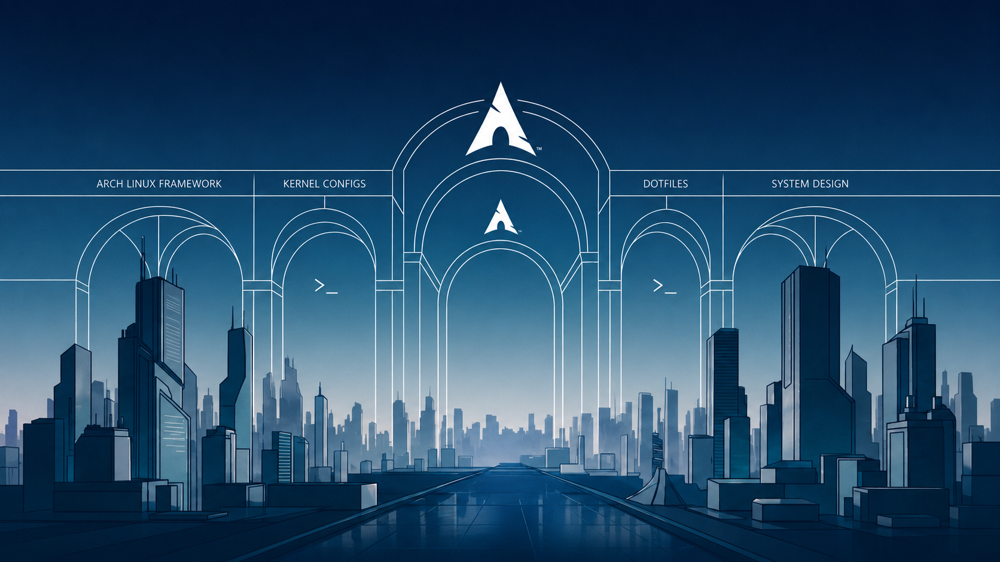

# LazyOS

> A minimal Arch Linux distro with Hyprland, clean by design.



---

## What is LazyOS?

LazyOS is a minimal, opinionated Arch Linux setup built around Hyprland. It's not a traditional distro — it's a clean, fast, Nordic-themed desktop with a modular installer and its own package manager wrapper.

No bloat. No unnecessary tools. Just what you need to have a working, beautiful system.

---

## Features

- **Hyprland v0.55+** — Wayland compositor with Lua config
- **Full Hypr ecosystem** — hyprlock, hypridle, hyprpaper, hyprshade
- **Nordic theme** — dark, clean, consistent across all apps
- **Modular installer** — inspired by Omarchy, easy to read and modify
- **`lazy`** — unified package manager (pacman + AUR in one command)
- **`lazyos-update`** — full system updater (packages + dotfiles)
- **greetd + hyprlock** — clean login screen, no bloated display manager
- **JetBrainsMono Nerd Font** — everywhere

---

## Stack

| Component | Tool |
|-----------|------|
| Compositor | Hyprland |
| Bar | Waybar |
| Launcher | Wofi |
| Terminal | Alacritty |
| Shell | Zsh |
| Notifications | Swaync |
| Lock screen | Hyprlock |
| Idle daemon | Hypridle |
| Wallpaper | Hyprpaper |
| Screen shader | Hyprshade |
| File manager | Thunar |
| Browser | Firefox |
| Display manager | greetd |

---

## Installation

Boot from an Arch Linux ISO, then:

```bash
git clone https://github.com/Halespider396/LazyOs.git
cd LazyOs
bash install.sh
```

Follow the prompts. The installer will:
- Partition and format your disk
- Install Arch base system
- Configure locale, timezone and users
- Install Hyprland + full LazyOS desktop
- Deploy all dotfiles automatically

> ⚠️ All data on the selected disk will be erased!

---

## Package Manager

LazyOS comes with `lazy` — a unified wrapper around pacman and yay:

```bash
sudo lazy -S <package>    # install (pacman first, then AUR)
sudo lazy -R <package>    # remove
sudo lazy -Syu            # full system update
sudo lazy -Sc             # clean cache + orphans
lazy -Ss <query>          # search pacman + AUR
lazy -Qs <query>          # search installed packages
lazy -Cu                  # check for updates
```

---

## Updating

```bash
sudo lazyos-update
```

Updates packages, dotfiles and `lazy` itself in one command.

---

## Keybinds

| Keybind | Action |
|---------|--------|
| `Super + Return` | Terminal |
| `Super + R` | App launcher |
| `Super + B` | Browser |
| `Super + E` | File manager |
| `Super + Q` | Close window |
| `Super + F` | Fullscreen |
| `Super + T` | Float window |
| `Super + L` | Lock screen |
| `Super + S` | Toggle blue light filter |
| `Super + C` | Color picker |
| `Super + N` | Notification center |
| `Super + V` | Clipboard history |
| `Super + Shift + E` | Logout menu |
| `Print` | Screenshot (output) |
| `Super + Print` | Screenshot (region) |

---

## GPU Drivers

Install after first boot:

```bash
# AMD
sudo lazy -S mesa vulkan-radeon

# Intel
sudo lazy -S mesa vulkan-intel

# NVIDIA
# Good luck 😉
# wiki.archlinux.org/title/NVIDIA
```

---

## Structure

```
LazyOs/
├── install.sh
├── install/
│   ├── helpers, preflight, user-input
│   ├── disk-setup, base-install, configure
│   ├── packages-install, dotfiles, finalize
│   └── packages/
│       ├── base.packages
│       └── aur.packages
├── hypr/
│   ├── hyprland.lua
│   └── UserConfigs/
│       ├── theme.lua, keybinds.lua, animations.lua
│       ├── autostart.lua, env.lua, monitors.lua
│       └── windowrules.lua
├── waybar/, wofi/, swaync/, alacritty/
├── hyprlock/, hypridle/, hyprpaper/, hyprshade/
├── wlogout/, fastfetch/, gtk/, greetd/, zsh/
├── wallpaper/
├── lazy
└── lazyos-update
```

---

## License

MIT — see [LICENSE](LICENSE)
